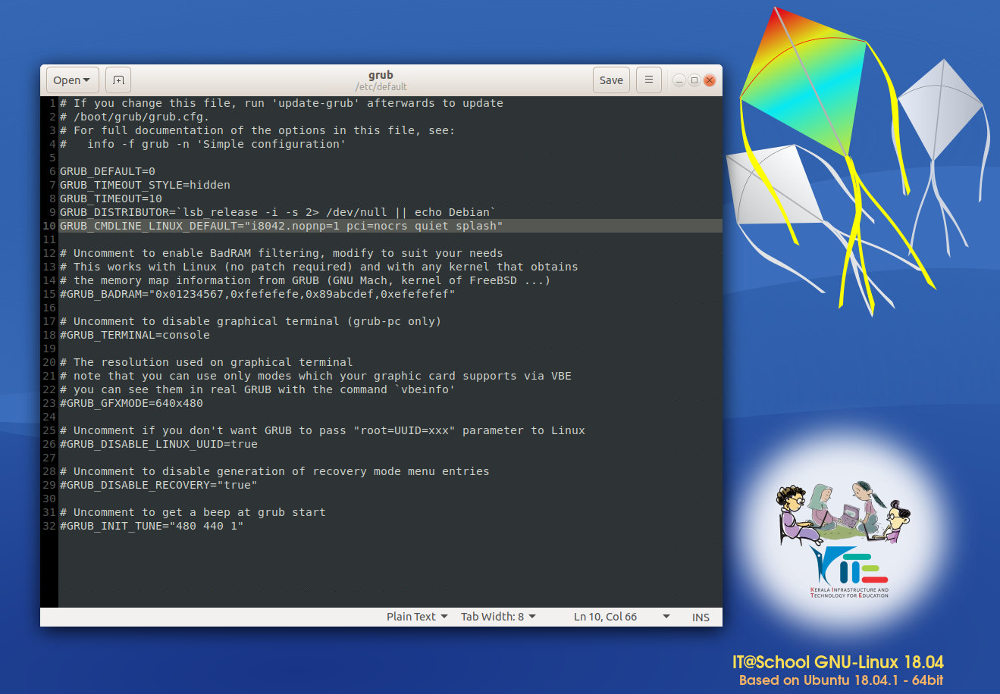

# Ubuntu ELAN Touchpad Fix

Fix issues regarding touchpad not working in certain laptop using elan drivers in ubuntu 18.04

### **Step 1.** Update the installed softwares by running commands below, and reboot.


```

sudo apt update && sudo apt upgrade -y && ubuntu-restricted-extras

sudo reboot

```

### **Step 2.** Upgrade to latest LTS Kernal with HWE.

```

sudo apt install --install-recommends linux-generic-hwe-18.04 xserver-xorg-hwe-18.04

```

### **Step 3.** Adding additional parameters to the kernel and reboot.

- **3.1 :**  Open grub file using below command.

        sudo gedit /etc/default/grub

- **3.2 :**  Insert  `i8042.nopnp=1 pci=nocrs` to the GRUB_CMDLINE_LINUX_DEFAULT see below.
      


## Affected Laptop Lists:
- hp 15s-du2071tu
- 